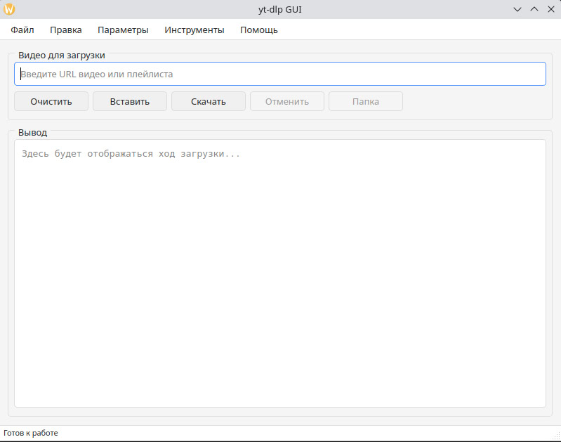

# yt-dlp GUI

Графический интерфейс для [yt-dlp](https://github.com/yt-dlp/yt-dlp) — мощного инструмента для загрузки видео с YouTube и других сайтов.



## Возможности

- 📥 Загрузка видео и плейлистов с YouTube и других поддерживаемых сайтов
- ⚙️ Гибкие настройки вывода:
  - Выбор папки для сохранения
  - Конструктор шаблонов имен файлов
  - Настройка формата объединения (mp4/mkv)
- 🔧 Дополнительные опции:
  - Запрет перезаписи файлов
  - Удаление спонсорских блоков
  - Добавление метаданных
  - Встраивание миниатюр
- 🔌 Настройки прокси и cookies
- 📊 Логирование операций
- 🔄 Проверка обновлений yt-dlp

## Требования

- Python 3.8+
- yt-dlp (автоматически загружается при первом запуске)
- Зависимости:
  - PyQt6
  - requests

## Установка

1. Клонируйте репозиторий:
   ```bash
   git clone https://github.com/ваш-репозиторий/yt-dlp-gui.git
   cd yt-dlp-gui
   ```

2. Установите зависимости:
   ```bash
   pip install -r requirements.txt
   ```

3. Запустите приложение:
   ```bash
   python gui_yt-dlp.py
   ```

## Сборка в исполняемый файл

Для сборки standalone версии используйте `build.py`:
```bash
python build.py
```

## Использование

1. Введите URL видео или плейлиста в поле ввода
2. Настройте параметры загрузки (опционально)
3. Нажмите "Скачать"

## Настройки

Все настройки сохраняются в файле `yt-dlp.conf` и могут быть:
- Экспортированы/импортированы через меню "Файл"
- Сброшены к значениям по умолчанию

Разработано с ❤️ для удобной загрузки видео.
